[instagram](https://www.instagram.com/ayushh.jpg/) &nbsp;·&nbsp;
[linkedin](https://www.linkedin.com/in/sharma-ayushhh/) &nbsp;·&nbsp;
[email](mailto:ayush.nitsgr@gmail.com) &nbsp;·&nbsp;
[portfolio](https://ayuxharma.github.io/portfolio)

> Associate Software Engineer at Oracle. 
> git commit -m "idk why this works but don't touch it"

If it's not solving a real problem, it's just cosplay with extra steps.

<samp>C++ &nbsp; Python &nbsp; Assembly &nbsp; LangGraph &nbsp; Redis  &nbsp; FastAPI &nbsp; React &nbsp; APEX &nbsp; PL/ SQL &nbsp; Oracle Cloud Infrastructure (OCI) &nbsp; Oracle Integration Cloud (OIC) &nbsp; Postgres &nbsp; Docker &nbsp; Kubernetes &nbsp; Git &nbsp; REST APIs &nbsp; SOAP UI &nbsp; RAG &nbsp; LLMs &nbsp; CI/CD &nbsp; Datadog &nbsp; Grafana &nbsp; Postman</samp>

